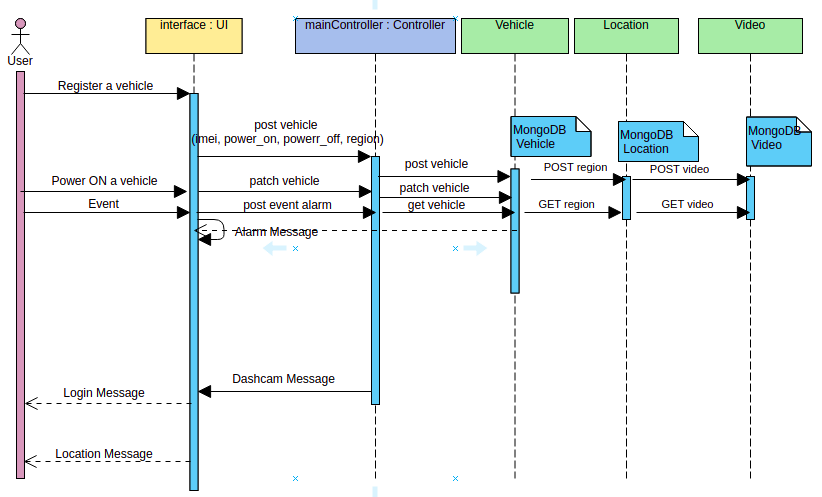

# TruckX Dashcam

## Dashcam APIs

The Login Message of vehicle's whose power_on is true. And Location Message gets displayed for all the vehicle registered on the dashcam on the terminal after every 1 minute.
Example :
<br>
**Login Message**
```
{
    "type": "LOGIN",
    "imei": "1234"
}
```

**Location Messgae**
```
{
    "type": "LOCATION",
    "location_time": "2021-05-29T17:47:23.631674368+05:30",
    "latitude": 18.52043,
    "longitude": 73.856744
}
```

There can be three microservice designed for the Dashcam Application.
The three microservices will be as follows :
1. Vehicle
2. Location
3. Video



#### **Vehicle Registration**

Registers a vehicle to the dashcam. 

Hit the API using postman to register a vehicle to the dashcam.

- **Request Method** : POST
- **URL** : <http://{ip}:{port}/api/v1/vehicle>
<!-- - **Parameters** :
    api-version : 2020-01-01 -->
- **Request Body** :
```
{
    "imei" : "1234",
    "power_on" : false,
    "power_off" : false,
    "region" : "india"
}
```
- **Response Body** :
```
{
    "imei": "1234",
    "power_on": false,
    "power_off": false,
    "region": "india"
}
```

#### **Vehicle Power ON and OFF**

Power on and off a vehicle on the dashcam. 

Hit the API using postman after registering a vehicle and then updating the power_on or power_off value of a vehicle

- **Request Method** : PATCH
- **URL** : <http://{ip}:{port}/api/v1/vehicle/{imei}>
- **Parameters** :
    imei : 1234
- **Request Body** :
```
{
    "power_on": true
}
```
- **Response Body** :
```
{
    "imei": "1234",
    "power_on": true,
    "power_off": false,
    "region": "india"
}
```

#### **Login Meassage**

Power on and off a vehicle on the dashcam.

This API gets hitted to the terminal if any of the vehicle which is registered to the dashcam has a power_on : true.

- **Request Method** : POST
- **URL** : <http://{ip}:{port}/api/v1/vehicle/login/{imei}>
- **Parameters** :
    imei : 1234
- **Response Body** :
```
{
    "type": "LOGIN",
    "imei": "1234"
}
```

#### **Vehicle List**

Get all the vehicles list registered on the dashcam.

- **Request Method** : GET
- **URL** : <http://{ip}:{port}/api/v1/vehicle/all>
- **Response Body** :
```
[
    {
        "imei": "1234",
        "power_on": true,
        "power_off": false,
        "region": "india"
    },
    {
        "imei": "1235",
        "power_on": false,
        "power_off": false,
        "region": "india"
    }
]
```

#### **Vehicle Detail**

Get a vehicle's details registered on the dashcam.

- **Request Method** : GET
- **URL** : <http://{ip}:{port}/api/v1/vehicle/{imei}>
- **Parameters** :
    imei : 1234
- **Response Body** :
```
{
    "imei": "1234",
    "power_on": true,
    "power_off": false,
    "region": "india"
}
```

#### **Vehicle Event**

Generate an event for a vehicle.

Hit the API using postman to generate an event of type "vibration", "overspeed", "crash", "hard_accelerated", "hard_brake", "sharp_turn". Make sure to use the imei is of a registered vehicle.

- **Request Method** : POST
- **URL** : <http://{ip}:{port}/api/v1/vehicle/{imei}/event/{alarm_type}>
- **Parameters** :
    imei : 1234
    alarm_type : crash
- **Response Body** :
```
{
    "Type": "ALARM",
    "AlarmType": "crash",
    "AlarmTime": "2021-05-29T14:32:59.334433389+05:30",
    "Latitude": 18.52043,
    "Longitude": 73.856744,
    "FileList": [
        "filename.mp4"
    ]
}
```

#### **Vehicle Video**

Post a vehicle video.

This API gets hitted inside the Vehicle Event API.

- **Request Method** : POST
- **URL** : <http://{ip}:{port}/api/v1/vehicle/video/{imei}>
- **Parameters** :
    imei : 1234
- **Response Body** :
```
{
    "imei: "1234"
    "file_name": "filename.mp4",
    "data": "filename"
}
```

#### **Dashcam Message**

Sends a message to the dashcam.

Hit the API using postman. The command has to be either "reboot" or "configure ip:port".

- **Request Method** : POST
- **URL** : <http://{ip}:{port}/api/v1/dashcam/{imei}/{command}>
- **Parameters** :
    imei : 1234
    command : reboot
- **Response Body** :
```
{
    "Type": "COMMAND",
    "IMEI": "1234",
    "Command": "configure ip:port"
}
```

#### **Location**

Post a location coordinates.

This API gets hitted inside the Vehicle Registration API.

- **Request Method** : POST
- **URL** : <http://{ip}:{port}/api/v1/location/{name}>
- **Parameters** :
    name : india
- **Response Body** :
```
{
    "name": "centralus",
    "latitude": 41.878003,
    "longitude": -93.097702
}
```

#### **Location Detail**

Get a location coordinates.

This API gets hitted inside the Vehicle Event API.

- **Request Method** : GET
- **URL** : <http://{ip}:{port}/api/v1/location/{name}>
- **Parameters** :
    name : india
- **Response Body** :
```
{
    "name": "centralus",
    "latitude": 41.878003,
    "longitude": -93.097702
}
```